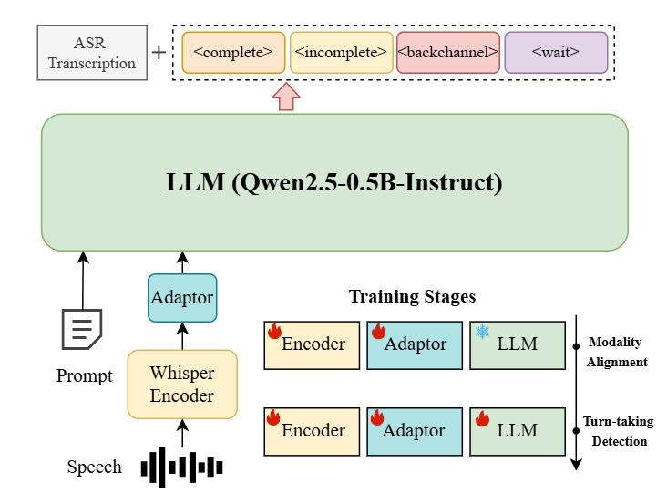
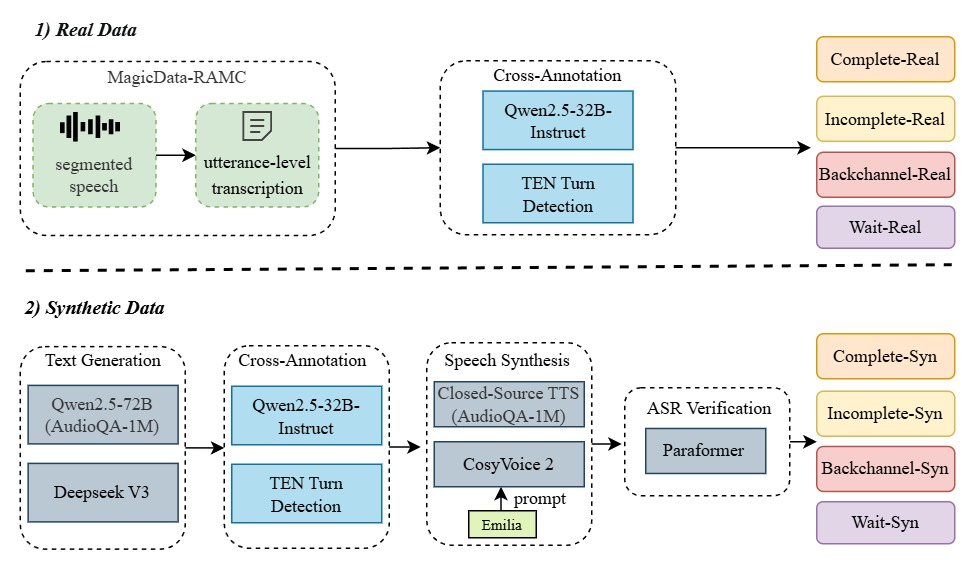
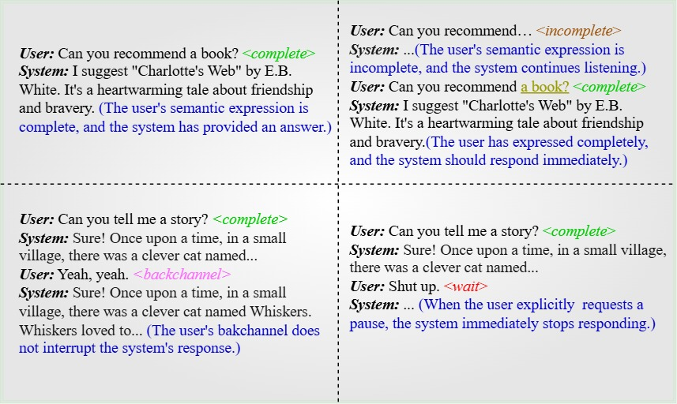

# Easy Turn: Integrating Acoustic and Linguistic Modalities for Robust Turn-Taking in Full-Duplex Spoken Dialogue Systems

<p align="center">
  Guojian Li<sup>1</sup>, Chengyou Wang<sup>1</sup>, Hongfei Xue<sup>1</sup>, 
  Shuiyuan Wang<sup>1</sup>, Dehui Gao<sup>1</sup>, Zihan Zhang<sup>2</sup>, 
  Yuke Lin<sup>2</sup>, Wenjie Li<sup>2</sup>, Longshuai Xiao<sup>2</sup>, 
  Zhonghua Fu<sup>1</sup><sup>,╀</sup>, Lei Xie<sup>1</sup><sup>,╀</sup>
</p>

<p align="center">
  <sup>1</sup> Audio, Speech and Language Processing Group (ASLP@NPU), Northwestern Polytechnical University <br>
  <sup>2</sup> Huawei Technologies, China <br>
</p>

<div align="center">

|  🎤 [Demo Page](https://aslp-lab.github.io/Easy-Turn/) | 🤖 [Easy Turn Model](https://huggingface.co/ASLP-lab/Easy-Turn) | 📑 [Paper](https://arxiv.org) | 🌐 [Huggingface](https://huggingface.co/collections/ASLP-lab/easy-turn-68d3ed0b294df61214428ea7) |
|:---:|:---:|:---:|:---:|

</div>


## Download
The Easy Turn resources are available at [Model](https://huggingface.co/ASLP-lab/Easy-Turn), [Trainset](https://huggingface.co/datasets/ASLP-lab/Easy-Turn-Trainset), and [Testset](https://huggingface.co/datasets/ASLP-lab/Easy-Turn-Testset).


## Easy Turn
Full-duplex interaction is crucial for natural human–machine communication, yet remains challenging as it requires robust turn-taking detection to decide when the system should speak, listen, or remain silent. Existing solutions either rely on dedicated turn-taking models, most of which are not open-sourced. The few available ones are limited by their large parameter size or by supporting only a single modality, such as acoustic or linguistic. Alternatively, some approaches finetune LLM backbones to enable full-duplex capability, but this requires large amounts of full-duplex data, which remain scarce in open-source form. To address these issues, we propose **Easy Turn**—an open-source, modular turn-taking detection model that integrates acoustic and linguistic bimodal information to predict four dialogue turn states: *complete* (semantically complete), *incomplete* (semantically incomplete), *backchannel* (brief feedback), and *wait* (request to pause or end the dialogue), accompanied by the release of **Easy Turn trainset**, a 1,145-hour speech dataset designed for training turn-taking detection models. Compared to existing open-source models like [TEN Turn Detection](https://github.com/ten-framework/ten-turn-detection) and [Smart Turn V2](https://github.com/pipecat-ai/smart-turn), our model achieves state-of-the-art turn-taking detection accuracy on our open-source **Easy Turn testset**.
<div align="center"></div>

## Easy Turn Trainset
The Easy Turn Trainset is a large-scale audio dataset for turn-taking detection, comprising both real and synthetic data. It contains four subsets corresponding to different conversational turn-taking states: 580 hours of complete turns, 532 hours of incomplete turns, 10 hours of backchannel turns, and 23 hours of wait turns, totaling approximately 1,100 hours. Each recording is accompanied by a text transcription and labeled with one of the four turn-taking states. 
<div align="center"></div>

## EXPERIMENTS
### Main Results
We evaluate **Easy Turn** against two open-source turn-taking detection models, TEN Turn Detection and Smart Turn V2, using the **Easy Turn testset**. All experiments are conducted on a single NVIDIA RTX 4090 GPU. Notably, since TEN Turn Detection lacks direct speech support, we use Paraformer as the ASR model to transcribe speech into text and take the text as its input. The table below reports the results: **ACC_cp**, **ACC_incp**, **ACC_bc** and **ACC_wait** denote the turn-taking detection accuracy for *complete*, *incomplete*, *backchannel*, and *wait* states (higher is better). **Params**, **Latency**, and **Memory** represent total model size, average inference time, and GPU usage, where lower values indicate greater efficiency.

| Model                         | Params (MB) ↓ | Latency (ms) | Memory (MB) | ACC_cp (%) ↑ | ACC_incp (%) | ACC_bc (%) | ACC_wait (%) |
|-------------------------------|---------------|--------------|-------------|--------------|--------------|------------|--------------|
| Paraformer + [TEN Turn Detection](https://github.com/ten-framework/ten-turn-detection) | 7220          | 204          | 15419       | 86.67        | 89.3         | –          | 91           |
| [Smart Turn V2](https://github.com/pipecat-ai/smart-turn)                 | **95**        | **27**       | **370**     | 78.67        | 62           | –          | –            |
| **Easy Turn (Proposed)**          | 850           | 263          | 2559        | **96.33**    | **97.67**    | **91**     | **98**       |

### Examples
We present several examples of Easy Turn applications in spoken dialogue systems. The content inside the angle brackets indicates the dialogue turn state detected by Easy Turn, while the text in parentheses represents the actions the system should take based on the detected dialogue turn state. To evaluate its performance in turn-taking detection, we deploy Easy Turn in our laboratory spoken dialogue system [OSUM-EChat](https://github.com/ASLP-lab/OSUM), where human users interact with the system through microphone input. The results show that Easy Turn performs effectively, accurately identifying dialogue turn states and enabling the system to respond appropriately. For the actual effect demonstration, you can refer to our [demo page](https://aslp-lab.github.io).
<div align="center"></div>

## Quick start
### Environment
Following the steps below to clone the repository and install the environment.
```bash 
# clone and enter the repositry
git clone https://github.com/ASLP-lab/Easy-Turn.git
cd Easy-Turn

## create python environment
conda create -n easy-turn python=3.10
conda activate easy-turn

## install requirements
pip install -r requirements.txt
```

### Inference
Please first download the Easy Turn's checkpoint at [Easy Turn](https://huggingface.co/ASLP-lab/Easy-Turn).
```bash
dir=
gpu_id=6
test_data_dir='data'
test_sets=''
ckpt_name=
task='<TRANSCRIBE><BACKCHANNEL><COMPLETE>' 
data_type='shard_full_data' # raw

bash decode/decode_common.sh \
    --data_type $data_type \
    --test_sets "$test_sets" \
    --test_data_dir $test_data_dir \
    --gpu_id $gpu_id \
    --dir $dir \
    --ckpt_name $ckpt_name \
    --task "$task" 
```
### Training
Coming soon.

## Citation
Please cite our paper if you find this work useful:


